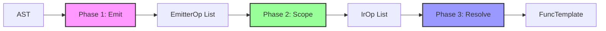

The Arc compiler transforms a parsed AST into executable bytecode through a three-phase pipeline: **Emit** (AST → symbolic IR), **Scope** (resolve variables to local indices), and **Resolve** (convert labels to PC addresses).

## Compiler pipeline

**Location**: `src/arc/compiler.gleam`

The compiler orchestrates three distinct phases, each producing progressively lower-level representations:



### Phase overview

<Accordion title="Phase 1: Emit">
  **Input**: AST (typed expression/statement tree)  
  **Output**: List of `EmitterOp` (IR instructions + scope metadata)  
  **File**: `src/arc/compiler/emit.gleam`
  
  Walks the AST recursively and emits symbolic IR:
  - Variables referenced by **name**: `IrScopeGetVar("x")`
  - Jumps use **label IDs**: `IrJump(42)`, `IrLabel(42)`
  - Scope markers track declarations: `EnterScope`, `DeclareVar`, `LeaveScope`
  
  Example:
  ```gleam
  // Input: const x = 40 + 2;
  [
    EnterScope(FunctionScope),
    DeclareVar("x", ConstBinding),
    Ir(IrPushConst(0)),        // 40
    Ir(IrPushConst(1)),        // 2
    Ir(IrBinOp(Add)),
    Ir(IrScopePutVar("x")),
    LeaveScope
  ]
  ```
</Accordion>

<Accordion title="Phase 2: Scope">
  **Input**: List of `EmitterOp`  
  **Output**: List of `IrOp` (scope markers consumed, locals assigned)  
  **File**: `src/arc/compiler/scope.gleam`
  
  Resolves symbolic variable names to local slot indices:
  - `IrScopeGetVar("x")` → `IrGetLocal(0)` or `IrGetGlobal("x")`
  - `IrScopePutVar("x")` → `IrPutLocal(0)` or `IrPutGlobal("x")`
  - Identifies **captured variables** and boxes them for closure sharing
  - Consumes scope markers (no longer needed)
  
  Example:
  ```gleam
  // After scope resolution:
  [
    IrPushConst(2),           // JsUninitialized (const TDZ)
    IrPutLocal(0),            // x → local slot 0
    IrPushConst(0),           // 40
    IrPushConst(1),           // 2
    IrBinOp(Add),
    IrPutLocal(0)             // store to x
  ]
  ```
</Accordion>

<Accordion title="Phase 3: Resolve">
  **Input**: List of `IrOp` (still has label IDs)  
  **Output**: `FuncTemplate` (bytecode array with absolute addresses)  
  **File**: `src/arc/compiler/resolve.gleam`
  
  Two-pass label resolution:
  1. **Pass 1**: Walk IR, build `Dict(label_id → pc_address)`
  2. **Pass 2**: Replace `IrJump(label)` → `Jump(pc)`, drop `IrLabel`
  
  Produces final bytecode ready for VM execution.
  
  Example:
  ```gleam
  FuncTemplate(
    bytecode: [
      PushConst(2),           // PC 0
      PutLocal(0),            // PC 1
      PushConst(0),           // PC 2
      PushConst(1),           // PC 3
      BinOp(Add),             // PC 4
      PutLocal(0)             // PC 5
    ],
    constants: [JsNumber(40.0), JsNumber(2.0), JsUninitialized],
    local_count: 1
  )
  ```
</Accordion>

## Entry point

```gleam
import arc/compiler
import arc/ast
import arc/vm/value

// Compile a parsed program:
case compiler.compile(program) {
  Ok(template) -> {
    // template: FuncTemplate — ready for VM execution
  }
  Error(compiler.BreakOutsideLoop) -> // Handle error
  Error(compiler.ContinueOutsideLoop) -> // Handle error
  Error(compiler.Unsupported(desc)) -> // Handle error
}
```

### Compile variants

<CodeGroup>
  ```gleam Script
  // Compile a script (may be sloppy or strict):
  case parser.parse(source, parser.Script) {
    Ok(ast.Script(body)) -> {
      case compiler.compile(ast.Script(body)) {
        Ok(template) -> // Execute
      }
    }
  }
  ```
  
  ```gleam Module
  // Compile a module (always strict):
  case parser.parse(source, parser.Module) {
    Ok(ast.Module(body)) -> {
      case compiler.compile_module(ast.Module(body)) {
        Ok(#(template, scope_dict)) -> {
          // scope_dict: Dict(String, Int) — name → local index
          // Used to extract exports after evaluation
        }
      }
    }
  }
  ```
  
  ```gleam REPL
  // Compile in REPL mode (top-level var/let/const are globals):
  case parser.parse(input, parser.Script) {
    Ok(ast.Script(body)) -> {
      case compiler.compile_repl(ast.Script(body)) {
        Ok(template) -> // Execute
      }
    }
  }
  ```
</CodeGroup>

## Phase 1: Emit

**File**: `src/arc/compiler/emit.gleam` (2500+ lines)

The emitter walks the AST and produces symbolic IR instructions mixed with scope metadata.

### EmitterOp type

```gleam
pub type EmitterOp {
  Ir(IrOp)                           // Real IR instruction
  EnterScope(kind: ScopeKind)        // Open new scope
  LeaveScope                         // Close current scope
  DeclareVar(name: String, kind: BindingKind)  // Declare variable
}

pub type ScopeKind {
  FunctionScope  // Function/script top-level
  BlockScope     // { ... } or for/while body
}

pub type BindingKind {
  VarBinding     // var declarations
  LetBinding     // let declarations
  ConstBinding   // const declarations
  ParamBinding   // function parameters
  CatchBinding   // catch clause parameter
}
```

### Key emit functions

<Accordion title="Statement emission">
  ```gleam
  fn emit_stmt(e: Emitter, stmt: ast.Statement) -> Result(Emitter, EmitError) {
    case stmt {
      ast.VariableDeclaration(kind, declarators) -> {
        // Emit scope markers + IR for each declarator
        list.try_fold(declarators, e, fn(e, decl) {
          let e = emit_op(e, DeclareVar(name, binding_kind))
          use e <- result.try(emit_expr(e, decl.init))
          Ok(emit_ir(e, IrScopePutVar(name)))
        })
      }
      
      ast.IfStatement(test, consequent, alternate) -> {
        use e <- result.try(emit_expr(e, test))
        let else_label = fresh_label(e)
        let end_label = fresh_label(e)
        let e = emit_ir(e, IrJumpIfFalse(else_label))
        use e <- result.try(emit_stmt(e, consequent))
        let e = emit_ir(e, IrJump(end_label))
        let e = emit_ir(e, IrLabel(else_label))
        // ... emit alternate ...
        Ok(emit_ir(e, IrLabel(end_label)))
      }
      
      // ... 30+ statement types
    }
  }
  ```
</Accordion>

<Accordion title="Expression emission">
  ```gleam
  fn emit_expr(e: Emitter, expr: ast.Expression) -> Result(Emitter, EmitError) {
    case expr {
      ast.NumberLiteral(n) -> {
        let #(e, idx) = add_constant(e, JsNumber(Finite(n)))
        Ok(emit_ir(e, IrPushConst(idx)))
      }
      
      ast.Identifier(name) -> {
        Ok(emit_ir(e, IrScopeGetVar(name)))
      }
      
      ast.BinaryExpression(op, left, right) -> {
        use e <- result.try(emit_expr(e, left))
        use e <- result.try(emit_expr(e, right))
        Ok(emit_ir(e, IrBinOp(op)))
      }
      
      ast.CallExpression(callee, args) -> {
        use e <- result.try(emit_expr(e, callee))
        use e <- result.try(emit_expr_list(e, args))
        Ok(emit_ir(e, IrCall(list.length(args))))
      }
      
      // ... 40+ expression types
    }
  }
  ```
</Accordion>

<Accordion title="Function compilation">
  Functions are compiled **recursively** — child functions are compiled during parent emission:
  
  ```gleam
  fn emit_function_declaration(
    e: Emitter,
    name: String,
    params: List(ast.Pattern),
    body: List(ast.Statement)
  ) -> Result(Emitter, EmitError> {
    // Compile child function into a CompiledChild
    let #(e, child) = compile_child_function(e, params, body)
    
    // Add to functions list, get index
    let func_index = e.next_func
    let e = Emitter(..e, functions: [child, ..e.functions], next_func: func_index + 1)
    
    // Emit MakeClosure instruction
    let e = emit_ir(e, IrMakeClosure(func_index))
    
    // Bind to name
    Ok(emit_ir(e, IrScopePutVar(name)))
  }
  ```
  
  Each child function captures:
  - Its own code (List of EmitterOp)
  - Its own constants
  - Its own child functions (grandchildren)
  - Metadata (name, arity, is_strict, is_arrow, etc.)
</Accordion>

### Hoisting

The emitter implements JavaScript's **hoisting** semantics:

```gleam
// Collect hoisted var declarations:
fn collect_hoisted_vars(stmts: List(ast.Statement>) -> List(String) {
  list.flat_map(stmts, fn(stmt) {
    case stmt {
      ast.VariableDeclaration(ast.Var, declarators) -> {
        // Extract all names from patterns
        list.flat_map(declarators, fn(decl) {
          collect_pattern_names(decl.id)
        })
      }
      ast.BlockStatement(body) -> collect_hoisted_vars(body)  // Recurse
      _ -> []
    }
  })
}

// Hoist function declarations:
let hoisted_vars = collect_hoisted_vars(stmts)
let e = list.fold(hoisted_vars, e, fn(e, name) {
  emit_op(e, DeclareVar(name, VarBinding))
})
```

This ensures var declarations are visible throughout the function scope, even before their syntactic position.

## Phase 2: Scope resolution

**File**: `src/arc/compiler/scope.gleam` (300+ lines)

The scope resolver walks the EmitterOp list, tracks variable bindings, and resolves names to local indices.

### Resolver state

```gleam
type Resolver {
  Resolver(
    scopes: List(Scope),                      // Stack of active scopes
    next_local: Int,                          // Next available local slot
    max_locals: Int,                          // Peak local usage
    output: List(IrOp),                       // Resolved IR
    constants: List(JsValue),                 // Constant pool
    constants_map: Dict(JsValue, Int),        // Dedup constants
    captured_vars: Set(String)                // Names of captured variables
  )
}

type Scope {
  Scope(
    kind: ScopeKind,                          // Function or block
    bindings: Dict(String, Binding)           // Name → binding info
  )
}

type Binding {
  Binding(
    index: Int,                               // Local slot index
    kind: BindingKind,                        // var/let/const/param
    is_boxed: Bool                            // Captured by child?
  )
}
```

### Resolution algorithm

<Steps>
  <Step title="Track scopes">
    Maintain a scope stack:
    ```gleam
    EnterScope(kind) -> {
      let scope = Scope(kind:, bindings: dict.new())
      Resolver(..r, scopes: [scope, ..r.scopes])
    }
    
    LeaveScope -> {
      case r.scopes {
        [_, ..rest] -> Resolver(..r, scopes: rest)
      }
    }
    ```
  </Step>
  
  <Step title="Allocate locals">
    When a variable is declared:
    ```gleam
    DeclareVar(name, kind) -> {
      let index = r.next_local
      let boxed = set.contains(r.captured_vars, name)
      let binding = Binding(index:, kind:, is_boxed: boxed)
      
      // Add to appropriate scope (var → function, let/const → current)
      let r = add_binding(r, name, binding)
      
      // Initialize slot:
      let r = emit(r, IrPushConst(uninit_idx))  // JsUninitialized
      let r = emit(r, IrPutLocal(index))
      
      // Box if captured:
      case boxed {
        True -> emit(r, IrBoxLocal(index))
        False -> r
      }
    }
    ```
  </Step>
  
  <Step title="Resolve references">
    Replace symbolic names with concrete operations:
    ```gleam
    Ir(IrScopeGetVar(name)) -> {
      case lookup(r.scopes, name) {
        Some(Binding(index:, is_boxed: True, ..)) -> 
          emit(r, IrGetBoxed(index))
        Some(Binding(index:, is_boxed: False, ..)) -> 
          emit(r, IrGetLocal(index))
        None -> 
          emit(r, IrGetGlobal(name))  // Not in local scope → global
      }
    }
    
    Ir(IrScopePutVar(name)) -> {
      case lookup(r.scopes, name) {
        Some(Binding(index:, is_boxed: True, ..)) -> 
          emit(r, IrPutBoxed(index))
        Some(Binding(index:, is_boxed: False, ..)) -> 
          emit(r, IrPutLocal(index))
        None -> 
          emit(r, IrPutGlobal(name))
      }
    }
    ```
  </Step>
</Steps>

### Closure capture and boxing

**Problem**: Closures must share mutable bindings with their parent scope.

```javascript
function outer() {
  let x = 0;
  return function inner() { return ++x; };
}
const f = outer();
f();  // 1
f();  // 2 — x is SHARED, not copied
```

**Solution**: Variables captured by child functions are **boxed** — stored in a heap-allocated `BoxSlot` instead of directly in the locals array.

<Steps>
  <Step title="Capture analysis (Phase 0)">
    Before scope resolution, analyze which variables are captured:
    ```gleam
    fn collect_all_captured_vars(
      children: List(CompiledChild),
      parent_ops: List(EmitterOp)
    ) -> Set(String) {
      let parent_declared = collect_declared_names(parent_ops)
      
      list.fold(children, set.new(), fn(acc, child) {
        let child_free_vars = collect_free_vars(child)
        set.intersection(child_free_vars, parent_declared)
        |> set.union(acc)
      })
    }
    ```
    
    A variable is captured if:
    1. Declared in parent
    2. Used (but not declared) in child
  </Step>
  
  <Step title="Box captured variables">
    During scope resolution, emit boxing instructions:
    ```gleam
    DeclareVar(name, kind) -> {
      let boxed = set.contains(r.captured_vars, name)
      // ... allocate local slot ...
      case boxed {
        True -> {
          // Wrap value in BoxSlot on heap:
          emit(r, IrBoxLocal(index))
          // Now locals[index] = JsObject(box_ref)
        }
        False -> r
      }
    }
    ```
  </Step>
  
  <Step title="Access boxed variables">
    Use `GetBoxed`/`PutBoxed` instead of `GetLocal`/`PutLocal`:
    ```gleam
    case lookup(scopes, name) {
      Some(Binding(is_boxed: True, index:, ..)) -> {
        // Dereference the box:
        IrGetBoxed(index)  // Read locals[index] as box_ref, push slot.value
      }
    }
    ```
  </Step>
  
  <Step title="Share boxes with children">
    Child functions capture the **box reference** (not the value):
    ```gleam
    // Parent has: locals[0] = JsObject(box_ref)
    // Child's env_descriptors: [CaptureLocal(0)]
    // → Child's locals[0] = parent's locals[0] (same box_ref)
    ```
    
    Both parent and child dereference the same `BoxSlot`, seeing each other's mutations.
  </Step>
</Steps>

**Why this works**:
- The box is heap-allocated (survives parent return)
- Both parent and child hold references to the **same box**
- Mutations update the box's `.value` field, visible to both

## Phase 3: Label resolution

**File**: `src/arc/compiler/resolve.gleam` (270+ lines)

The final phase converts symbolic label IDs into absolute PC addresses.

### Two-pass algorithm

<Accordion title="Pass 1: Collect labels">
  Walk the IR and build a map from label ID to PC address:
  ```gleam
  fn build_label_map(
    code: List(IrOp>,
    pc: Int,
    map: Dict(Int, Int)
  ) -> Dict(Int, Int) {
    case code {
      [] -> map
      [IrLabel(id), ..rest] -> {
        // Label doesn't occupy a PC slot
        build_label_map(rest, pc, dict.insert(map, id, pc))
      }
      [_, ..rest] -> {
        // All other ops occupy one PC slot
        build_label_map(rest, pc + 1, map)
      }
    }
  }
  ```
  
  **Result**: `Dict(label_id → pc_address)`
</Accordion>

<Accordion title="Pass 2: Resolve jumps">
  Replace symbolic jumps with concrete addresses:
  ```gleam
  fn resolve_ops(
    code: List(IrOp>,
    labels: Dict(Int, Int),
    acc: List(Op>
  ) -> List(Op> {
    case code {
      [IrLabel(_), ..rest] -> 
        // Drop labels (they were just markers)
        resolve_ops(rest, labels, acc)
      
      [IrJump(label), ..rest] -> {
        let assert Ok(pc) = dict.get(labels, label)
        resolve_ops(rest, labels, [Jump(pc), ..acc])
      }
      
      [IrJumpIfFalse(label), ..rest] -> {
        let assert Ok(pc) = dict.get(labels, label)
        resolve_ops(rest, labels, [JumpIfFalse(pc), ..acc])
      }
      
      // ... all other IrOp → Op translations (1:1)
    }
  }
  ```
</Accordion>

### Final output: FuncTemplate

```gleam
pub type FuncTemplate {
  FuncTemplate(
    name: Option(String),
    arity: Int,
    local_count: Int,
    bytecode: Array(Op),                  // Executable bytecode
    constants: Array(JsValue),            // Constant pool
    functions: Array(FuncTemplate),       // Child functions
    env_descriptors: List(EnvCapture),    // Closure captures
    is_strict: Bool,
    is_arrow: Bool,
    is_derived_constructor: Bool,
    is_generator: Bool,
    is_async: Bool
  )
}
```

This is the final artifact ready for VM execution.

## Compiler optimizations

<Note>
Arc's compiler prioritizes **correctness** and **ES2023+ spec compliance** over aggressive optimization. The current implementation is a proof-of-concept.
</Note>

### Current optimizations

- **Constant deduplication**: Identical constants share the same pool index
- **Tail position optimization**: Last statement in a block keeps its value on stack (no Pop)
- **Boxed variable analysis**: Only captured variables are boxed (minimize indirection)

### Future optimizations

<AccordionGroup>
  <Accordion title="Peephole optimizations">
    Local bytecode patterns:
    ```gleam
    // Before:
    PushConst(0)
    Pop
    // After: (deleted)
    
    // Before:
    PushConst(idx)
    JumpIfFalse(L1)
    Jump(L2)
    Label(L1)
    // After:
    PushConst(idx)
    JumpIfTrue(L2)
    ```
  </Accordion>
  
  <Accordion title="Constant folding">
    Evaluate constant expressions at compile time:
    ```javascript
    const x = 40 + 2;  // Fold to 42
    ```
    
    Currently emits:
    ```gleam
    PushConst(0)  // 40
    PushConst(1)  // 2
    BinOp(Add)
    ```
    
    Could emit:
    ```gleam
    PushConst(0)  // 42
    ```
  </Accordion>
  
  <Accordion title="Inline caching">
    Cache property lookups:
    ```javascript
    for (let i = 0; i < arr.length; i++) { ... }
    //                      ^^^^^^ — cache this lookup
    ```
    
    First access: full property lookup  
    Subsequent: check shape, use cached offset
  </Accordion>
  
  <Accordion title="Escape analysis">
    Detect variables that don't escape their function:
    ```javascript
    function foo() {
      let x = 42;
      return x + 1;  // x doesn't escape — no boxing needed
    }
    ```
    
    Currently boxes all captured vars. Could elide boxing for non-escaping captures.
  </Accordion>
</AccordionGroup>

## REPL mode

The compiler has a special REPL mode where top-level `var`/`let`/`const` resolve to **global variables** instead of local slots:

```gleam
pub fn compile_repl(program: ast.Program) -> Result(FuncTemplate, CompileError)
```

Key differences:

<CodeGroup>
  ```gleam Normal mode
  // var x = 42;
  DeclareVar("x", VarBinding)      // Allocate local slot
  IrPushConst(0)                   // 42
  IrScopePutVar("x")               // → IrPutLocal(index)
  ```
  
  ```gleam REPL mode
  // var x = 42;
  IrDeclareGlobalVar("x")          // Create globalThis.x
  IrPushConst(0)                   // 42
  IrScopePutVar("x")               // → IrPutGlobal("x")
  ```
</CodeGroup>

This allows REPL declarations to persist across evaluations (stored on `globalThis`).

## Module compilation

Modules are always compiled in strict mode with special export handling:

```gleam
pub fn compile_module(
  program: ast.Program
) -> Result(#(FuncTemplate, Dict(String, Int)), CompileError)
```

**Returns**:
1. `FuncTemplate` — executable module code
2. `Dict(String, Int)` — scope dict mapping export names to local indices

The scope dict is used after evaluation to extract export bindings:

```gleam
// Compile module:
let #(template, scope_dict) = compiler.compile_module(module)

// Execute:
case vm.run_module(template, heap, builtins, global_object) {
  ModuleOk(value, heap, locals) -> {
    // Extract exports:
    let assert Ok(x_index) = dict.get(scope_dict, "x")
    let x_value = array.get(x_index, locals)  // Export binding
  }
}
```

### Default exports

Default exports are compiled to a local binding named `"*default*"`:

```javascript
export default 42;
```

Compiles to:

```gleam
DeclareVar("*default*", ConstBinding)
IrPushConst(0)  // 42
IrScopePutVar("*default*")
```

The export system maps `"default"` → `"*default*"` in the scope dict.

## Error handling

```gleam
pub type CompileError {
  BreakOutsideLoop
  ContinueOutsideLoop
  Unsupported(description: String)
}
```

Most syntax errors are caught by the **parser**. The compiler only reports semantic errors that require full program analysis (e.g., break outside loop).

## Further reading

<CardGroup cols={2}>
  <Card title="VM" icon="microchip" href="./vm.mdx">
    How bytecode is executed
  </Card>
  <Card title="Parser" icon="code" href="./parser.mdx">
    AST construction and validation
  </Card>
  <Card title="Emit (source)" icon="wand-magic-sparkles" href="https://github.com/arc-lang/arc/blob/main/src/arc/compiler/emit.gleam">
    Phase 1 implementation
  </Card>
  <Card title="Scope (source)" icon="layer-group" href="https://github.com/arc-lang/arc/blob/main/src/arc/compiler/scope.gleam">
    Phase 2 implementation
  </Card>
</CardGroup>