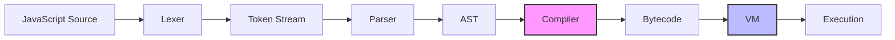

Arc is a JavaScript runtime built on the BEAM VM, written in Gleam. It implements ES2023+ strict mode JavaScript with full support for classes, generators, async/await, and module systems.

## Pipeline architecture

Arc uses a multi-phase pipeline to transform JavaScript source code into executable bytecode:



### Phase 1: Lexical analysis

The **lexer** (`src/arc/lexer.gleam`) scans the source string and produces a token stream. It handles:

- ES2023+ keywords and operators
- String literals with escape sequences
- Numeric literals (decimal, binary, octal, hex)
- Regular expression literals
- Template literals
- Automatic semicolon insertion

### Phase 2: Parsing

The **parser** (`src/arc/parser.gleam`) consumes tokens and builds an Abstract Syntax Tree (AST). See [Parser details](./parser.mdx) for the full implementation.

Key features:
- Recursive descent parsing for statements
- Pratt parsing for expression precedence
- ES2023+ strict mode enforcement
- Full module and script support

### Phase 3: Compilation

The **compiler** (`src/arc/compiler.gleam`) transforms the AST into executable bytecode through a three-phase pipeline:

1. **Emit** → AST to symbolic IR (EmitterOp)
2. **Scope** → Resolve variables to local indices
3. **Resolve** → Convert labels to absolute addresses

See [Compiler details](./compiler.mdx) for the complete compilation process.

### Phase 4: Execution

The **VM** (`src/arc/vm/vm.gleam`) executes bytecode using a stack machine model. See [VM details](./vm.mdx).

## Core components

### Lexer

**Location**: `src/arc/lexer.gleam`

Converts raw source text into tokens. Handles all ES2023+ token types including:
- Keywords (`function`, `class`, `async`, etc.)
- Operators (`+`, `===`, `?.`, `??`, etc.)
- Literals (strings, numbers, regex, templates)
- Identifiers and contextual keywords

### Parser

**Location**: `src/arc/parser.gleam`

Builds a complete AST with semantic validation:
- Strict mode enforcement
- TDZ (Temporal Dead Zone) tracking
- Scope analysis (lexical vs var)
- Export/import validation for modules

The parser produces a typed AST (`ast.Program`) with variants for scripts and modules.

### Compiler

**Location**: `src/arc/compiler.gleam`, `src/arc/compiler/emit.gleam`, `src/arc/compiler/scope.gleam`, `src/arc/compiler/resolve.gleam`

Three-phase bytecode compiler:

<AccordionGroup>
  <Accordion title="Phase 1: Emit">
    **File**: `src/arc/compiler/emit.gleam`
    
    Walks the AST and produces symbolic IR:
    - Variable references use string names (`IrScopeGetVar("x")`)
    - Jump targets use label IDs (`IrJump(42)`)
    - Scope markers track variable declarations
    
    **Output**: List of `EmitterOp` (IR + scope metadata)
  </Accordion>
  
  <Accordion title="Phase 2: Scope resolution">
    **File**: `src/arc/compiler/scope.gleam`
    
    Resolves symbolic variable names to local slot indices:
    - Tracks block scopes and function scopes
    - Identifies captured variables (closures)
    - Boxes captured vars for shared mutation
    - Converts `IrScopeGetVar(name)` → `IrGetLocal(index)` or `IrGetGlobal(name)`
    
    **Output**: List of `IrOp` (no scope markers, local indices assigned)
  </Accordion>
  
  <Accordion title="Phase 3: Label resolution">
    **File**: `src/arc/compiler/resolve.gleam`
    
    Converts label IDs to absolute PC addresses:
    - Two-pass algorithm (collect labels, then resolve)
    - Converts `IrJump(label_id)` → `Jump(pc_address)`
    - Drops `IrLabel` markers
    
    **Output**: `FuncTemplate` (ready for VM execution)
  </Accordion>
</AccordionGroup>

### VM

**Location**: `src/arc/vm/vm.gleam`

Stack-based bytecode interpreter:
- 80+ opcodes covering ES2023+ semantics
- Heap-allocated objects and closures
- Generator and async/await support
- Promise job queue for microtasks

The VM operates on a `State` containing:
- **Stack**: operand stack for expression evaluation
- **Locals**: local variable slots (indexed array)
- **Heap**: garbage-collected object storage
- **Call stack**: saved frames for function calls
- **Try stack**: exception handler frames

### Built-in objects

**Location**: `src/arc/vm/builtins/*.gleam`

Native implementations of JavaScript built-ins:
- `Object`, `Array`, `String`, `Number`, `Boolean`
- `Function`, `Symbol`, `Promise`
- `Math`, `JSON`, `Error`
- `Map`, `Set`, `WeakMap`, `WeakSet`
- `RegExp`
- **Arc namespace** (BEAM interop): `Arc.spawn`, `Arc.send`, `Arc.receive`

See [Built-ins details](./builtins.mdx).

## Data flow example

Here's how `const x = 40 + 2` flows through the pipeline:

<Steps>
  <Step title="Lexer">
    ```
    [Const, Identifier("x"), Equal, Number(40), Plus, Number(2)]
    ```
  </Step>
  
  <Step title="Parser">
    ```gleam
    VariableDeclaration(
      kind: Const,
      declarations: [
        VariableDeclarator(
          id: IdentifierPattern("x"),
          init: Some(BinaryExpression(
            operator: Add,
            left: NumberLiteral(40.0),
            right: NumberLiteral(2.0)
          ))
        )
      ]
    )
    ```
  </Step>
  
  <Step title="Compiler Phase 1 (Emit)">
    ```gleam
    [
      EnterScope(FunctionScope),
      DeclareVar("x", ConstBinding),
      Ir(IrPushConst(0)),    // 40
      Ir(IrPushConst(1)),    // 2
      Ir(IrBinOp(Add)),
      Ir(IrScopePutVar("x")),
      LeaveScope
    ]
    ```
  </Step>
  
  <Step title="Compiler Phase 2 (Scope)">
    ```gleam
    [
      IrPushConst(2),        // JsUninitialized
      IrPutLocal(0),         // x → local slot 0
      IrPushConst(0),        // 40
      IrPushConst(1),        // 2
      IrBinOp(Add),
      IrPutLocal(0)          // store to x
    ]
    ```
  </Step>
  
  <Step title="Compiler Phase 3 (Resolve)">
    ```gleam
    FuncTemplate(
      bytecode: [
        PushConst(2),
        PutLocal(0),
        PushConst(0),
        PushConst(1),
        BinOp(Add),
        PutLocal(0)
      ],
      constants: [JsNumber(Finite(40.0)), JsNumber(Finite(2.0)), JsUninitialized],
      local_count: 1
    )
    ```
  </Step>
  
  <Step title="VM Execution">
    **PC 0**: Push `JsUninitialized` onto stack  
    **PC 1**: Pop and store to `locals[0]` (x is now in TDZ)  
    **PC 2**: Push `JsNumber(40.0)`  
    **PC 3**: Push `JsNumber(2.0)`  
    **PC 4**: Pop two, add, push `JsNumber(42.0)`  
    **PC 5**: Pop and store to `locals[0]` (x = 42)
    
    **Final state**: `locals[0] = JsNumber(Finite(42.0))`
  </Step>
</Steps>

## Key design decisions

### Immutable compilation artifacts

All compiler phases produce immutable data structures. The compiler is pure — same AST always produces identical bytecode.

### Three-phase compilation

Separating emit/scope/resolve allows:
- Clean separation of concerns (AST → IR → locals → addresses)
- Easy debugging (inspect IR at each phase)
- Composable optimizations (could insert passes between phases)

### Closure capture via boxing

Variables captured by nested closures are **boxed**: stored in a heap-allocated `BoxSlot` instead of directly in locals. Both parent and child hold references to the same box, enabling shared mutable state across closure boundaries (true JavaScript semantics).

Example:
```javascript
function outer() {
  let x = 0;
  return function inner() { return ++x; };
}
const f = outer();
f(); // 1
f(); // 2 — x is shared, not copied
```

The compiler's capture analysis (`collect_all_captured_vars` in `compiler.gleam:346`) detects `x` is used by `inner`, emits `BoxLocal(x_index)` in `outer`, and `inner` receives a capture descriptor pointing to the boxed slot.

### Stack machine model

The VM uses a stack machine (no register allocation). This simplifies:
- Code generation (no register pressure)
- Expression evaluation (natural postfix form)
- Exception unwinding (stack depth tracking)

Trade-off: More stack operations vs register-based, but simpler implementation and good enough performance for the initial version.

## BEAM integration

Arc runs on the Erlang VM (BEAM), enabling:

- **Process spawning**: `Arc.spawn(fn)` creates a new BEAM process
- **Message passing**: `Arc.send(pid, msg)`, `Arc.receive()`
- **Actor model**: JavaScript code can participate in OTP supervision trees
- **Distributed computing**: Transparent message passing across nodes

The runtime bridges JavaScript and Erlang types:
- JS primitives ↔ Erlang terms
- JS objects → Erlang maps (with restrictions)
- PIDs are first-class JS values

See `src/arc/vm/builtins/arc.gleam` for the implementation.

## Performance characteristics

<Note>
Arc is a **proof-of-concept runtime** optimized for correctness and ES2023+ spec compliance, not production performance. It's designed for educational purposes and exploring JavaScript/BEAM integration.
</Note>

**Current bottlenecks**:
- No JIT compilation (pure bytecode interpreter)
- Immutable data structures (Gleam's persistent collections)
- Heap allocation per operation (GC pressure)
- No inline caching for property access

**Future optimizations**:
- Bytecode-level peephole optimizations
- Inline caching for hot paths
- Primitive specialization (tagged integers)
- Native function inlining

## Next steps

<CardGroup cols={2}>
  <Card title="Parser" icon="code" href="./parser.mdx">
    Recursive descent parsing and Pratt expression handling
  </Card>
  <Card title="Compiler" icon="gears" href="./compiler.mdx">
    Three-phase bytecode compilation pipeline
  </Card>
  <Card title="VM" icon="microchip" href="./vm.mdx">
    Stack machine execution and heap management
  </Card>
  <Card title="Built-ins" icon="box" href="./builtins.mdx">
    Native JavaScript objects and Arc namespace
  </Card>
</CardGroup>