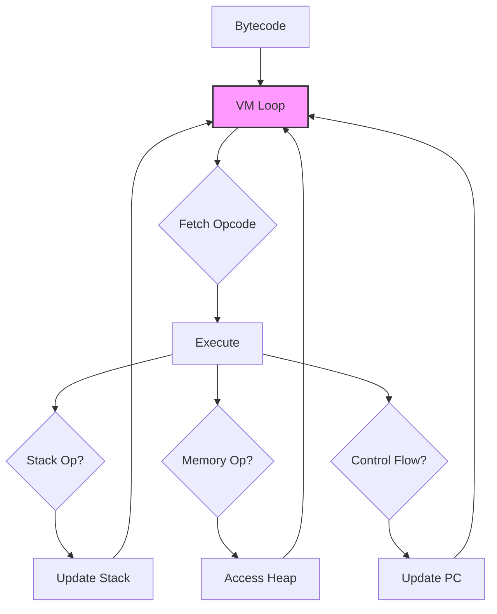

The Arc VM is a stack-based bytecode interpreter that executes compiled JavaScript. It implements ES2023+ semantics including generators, async/await, promises, and exception handling.

## VM architecture

**Location**: `src/arc/vm/vm.gleam` (5000+ lines)

The VM operates as a classic stack machine with heap-allocated objects:



### VM state

```gleam
pub type State {
  State(
    // Execution state
    stack: List(JsValue),              // Operand stack
    locals: Array(JsValue),            // Local variable slots
    constants: Array(JsValue),         // Constant pool
    pc: Int,                           // Program counter
    code: Array(Op),                   // Bytecode array
    func: FuncTemplate,                // Current function template
    
    // Call stack
    call_stack: List(SavedFrame),      // Saved frames for returns
    
    // Exception handling
    try_stack: List(TryFrame),         // Catch handlers
    finally_stack: List(FinallyCompletion),  // Finally blocks
    
    // Memory
    heap: Heap,                        // Object heap
    
    // Globals
    global_object: Ref,                // globalThis reference
    lexical_globals: Dict(String, JsValue),  // let/const globals
    const_lexical_globals: Set(String),      // Const global names
    
    // Built-ins
    builtins: Builtins,                // Object, Array, etc.
    
    // Runtime context
    this_binding: JsValue,             // Current 'this'
    callee_ref: Option(Ref),           // Current function ref
    call_args: List(JsValue),          // Current call arguments
    
    // Async/promises
    job_queue: List(PromiseReaction),  // Microtask queue
    
    // Symbols
    symbol_descriptions: Dict(SymbolId, String),
    symbol_registry: Dict(String, SymbolId),
    
    // Re-entrant helpers
    js_to_string: fn(State, JsValue) -> Result(...),
    call_fn: fn(State, JsValue, JsValue, List(JsValue)) -> Result(...)
  )
}
```

## Execution model

The VM executes bytecode in a tail-recursive loop:

```gleam
fn execute_inner(state: State) -> Result(#(Completion, State), VmError) {
  case array.get(state.pc, state.code) {
    None -> {
      // End of bytecode — return top of stack or undefined
      case state.stack {
        [top, ..] -> Ok(#(NormalCompletion(top, state.heap), state))
        [] -> Ok(#(NormalCompletion(JsUndefined, state.heap), state))
      }
    }
    Some(op) -> {
      case step(state, op) {
        Ok(new_state) -> execute_inner(new_state)  // Continue
        Error(#(Done, value, heap)) -> // Normal return
        Error(#(Thrown, value, heap)) -> // Uncaught exception
        Error(#(Yielded, value, heap)) -> // Generator yield
        Error(#(VmError(err), _, _)) -> // VM bug
      }
    }
  }
}
```

<Steps>
  <Step title="Fetch">
    Read opcode at `state.code[state.pc]`
  </Step>
  
  <Step title="Decode">
    Pattern match on opcode variant
  </Step>
  
  <Step title="Execute">
    Perform operation (update stack, heap, pc, etc.)
  </Step>
  
  <Step title="Loop">
    Tail-recurse with new state
  </Step>
</Steps>

### Completion types

```gleam
pub type Completion {
  NormalCompletion(value: JsValue, heap: Heap)
  ThrowCompletion(value: JsValue, heap: Heap)
  YieldCompletion(value: JsValue, heap: Heap)
}
```

- **NormalCompletion**: Execution finished successfully
- **ThrowCompletion**: Uncaught exception (no catch handler)
- **YieldCompletion**: Generator suspended (`yield` or `await`)

## Stack machine operations

The VM implements 80+ opcodes covering all ES2023+ semantics.

### Stack manipulation

<CodeGroup>
  ```gleam PushConst
  PushConst(index) -> {
    case array.get(index, state.constants) {
      Some(value) ->
        Ok(State(
          ..state,
          stack: [value, ..state.stack],
          pc: state.pc + 1
        ))
    }
  }
  ```
  
  ```gleam Pop
  Pop -> {
    case state.stack {
      [_, ..rest] -> Ok(State(
        ..state,
        stack: rest,
        pc: state.pc + 1
      ))
    }
  }
  ```
  
  ```gleam Dup
  Dup -> {
    case state.stack {
      [top, ..] -> Ok(State(
        ..state,
        stack: [top, ..state.stack],
        pc: state.pc + 1
      ))
    }
  }
  ```
  
  ```gleam Swap
  Swap -> {
    case state.stack {
      [a, b, ..rest] -> Ok(State(
        ..state,
        stack: [b, a, ..rest],
        pc: state.pc + 1
      ))
    }
  }
  ```
</CodeGroup>

### Variable access

<CodeGroup>
  ```gleam GetLocal
  GetLocal(index) -> {
    case array.get(index, state.locals) {
      Some(JsUninitialized) -> {
        // TDZ violation
        throw_reference_error(state, "Cannot access variable before initialization")
      }
      Some(value) -> Ok(State(
        ..state,
        stack: [value, ..state.stack],
        pc: state.pc + 1
      ))
    }
  }
  ```
  
  ```gleam PutLocal
  PutLocal(index) -> {
    case state.stack {
      [value, ..rest] -> {
        case array.set(index, value, state.locals) {
          Ok(new_locals) -> Ok(State(
            ..state,
            stack: rest,
            locals: new_locals,
            pc: state.pc + 1
          ))
        }
      }
    }
  }
  ```
  
  ```gleam GetGlobal
  GetGlobal(name) -> {
    // Check lexical globals first (let/const)
    case dict.get(state.lexical_globals, name) {
      Ok(JsUninitialized) -> throw_reference_error(...)  // TDZ
      Ok(value) -> Ok(...)
      Error(_) -> {
        // Check globalThis object record
        case object.get_property(state.heap, state.global_object, name) {
          Some(prop) -> Ok(...)
          None -> throw_reference_error(state, name <> " is not defined")
        }
      }
    }
  }
  ```
</CodeGroup>

### Binary operations

```gleam
BinOp(kind) -> {
  case state.stack {
    [right, left, ..rest] -> {
      case exec_binop(kind, left, right) {
        Ok(result) -> Ok(State(
          ..state,
          stack: [result, ..rest],
          pc: state.pc + 1
        ))
        Error(msg) -> throw_type_error(state, msg)
      }
    }
  }
}

fn exec_binop(kind: BinOpKind, left: JsValue, right: JsValue) -> Result(JsValue, String) {
  case kind {
    Add -> {
      case left, right {
        JsString(a), _ | _, JsString(b) -> {
          // String concatenation
          let a_str = to_string(left)
          let b_str = to_string(right)
          Ok(JsString(a_str <> b_str))
        }
        _, _ -> {
          // Numeric addition
          case to_number(left), to_number(right) {
            Ok(a), Ok(b) -> Ok(JsNumber(num_add(a, b)))
          }
        }
      }
    }
    Sub | Mul | Div | Mod -> // Numeric ops
    Eq | StrictEq | NotEq | StrictNotEq -> // Equality
    Lt | Gt | LtEq | GtEq -> // Relational
    // ... 20+ binary operators
  }
}
```

### Control flow

<CodeGroup>
  ```gleam Jump
  Jump(target) -> Ok(State(
    ..state,
    pc: target
  ))
  ```
  
  ```gleam JumpIfFalse
  JumpIfFalse(target) -> {
    case state.stack {
      [value, ..rest] -> {
        let is_truthy = value.is_truthy(value)
        Ok(State(
          ..state,
          stack: rest,
          pc: case is_truthy {
            True -> state.pc + 1
            False -> target
          }
        ))
      }
    }
  }
  ```
  
  ```gleam JumpIfTrue
  JumpIfTrue(target) -> {
    // Similar to JumpIfFalse, inverted condition
  }
  ```
  
  ```gleam JumpIfNullish
  JumpIfNullish(target) -> {
    case state.stack {
      [JsNull, ..rest] | [JsUndefined, ..rest] -> 
        Ok(State(..state, stack: rest, pc: target))
      [_, ..rest] -> 
        Ok(State(..state, stack: rest, pc: state.pc + 1))
    }
  }
  ```
</CodeGroup>

### Function calls

```gleam
Call(arity) -> {
  // Stack: [arg_n, ..., arg_1, callee, ...rest]
  case pop_n(state.stack, arity) {
    Some(#(args, [JsObject(callee_ref), ..rest])) -> {
      case heap.read(state.heap, callee_ref) {
        Some(ObjectSlot(
          kind: FunctionObject(func_template:, env:),
          ..
        )) -> {
          call_function(
            state,
            callee_ref,
            env,
            func_template,
            args,
            rest,
            JsUndefined,  // this = undefined (non-method call)
            None,         // constructor_this
            None          // new_target
          )
        }
        Some(ObjectSlot(kind: NativeFunction(native), ..)) -> {
          call_native(state, native, args, rest, JsUndefined)
        }
      }
    }
  }
}
```

**Call function logic**:

<Steps>
  <Step title="Save current frame">
    ```gleam
    let saved_frame = SavedFrame(
      func: state.func,
      locals: state.locals,
      stack: rest,  // Caller's stack (after popping args + callee)
      pc: state.pc + 1,
      try_stack: state.try_stack,
      this_binding: state.this_binding,
      constructor_this: None,
      callee_ref: state.callee_ref,
      call_args: state.call_args
    )
    ```
  </Step>
  
  <Step title="Set up new frame">
    ```gleam
    let new_locals = array.repeat(JsUndefined, func_template.local_count)
    
    // Bind parameters
    let new_locals = list.index_fold(args, new_locals, fn(locals, arg, idx) {
      array.set(idx, arg, locals)
    })
    
    // Restore captured env
    let new_locals = case env {
      Some(env_ref) -> {
        case heap.read(state.heap, env_ref) {
          Some(EnvSlot(captures)) -> {
            // Captures are already boxed refs from parent
            list.index_fold(captures, new_locals, fn(locals, capture, idx) {
              array.set(idx, capture, locals)
            })
          }
        }
      }
      None -> new_locals
    }
    ```
  </Step>
  
  <Step title="Enter new function">
    ```gleam
    State(
      ..state,
      func: func_template,
      code: func_template.bytecode,
      constants: func_template.constants,
      locals: new_locals,
      stack: [],  // Fresh stack for new frame
      pc: 0,      // Start at beginning of function
      call_stack: [saved_frame, ..state.call_stack],
      try_stack: [],  // Fresh try stack
      this_binding: this_val,
      callee_ref: Some(callee_ref),
      call_args: args
    )
    ```
  </Step>
</Steps>

### Return

```gleam
Return -> {
  let return_value = case state.stack {
    [value, ..] -> value
    [] -> JsUndefined
  }
  
  case state.call_stack {
    [] -> Error(#(Done, return_value, state.heap))  // Top-level return
    
    [SavedFrame(func:, locals:, stack:, pc:, try_stack:, this_binding:, ...), ..rest] -> {
      // Restore caller's frame
      Ok(State(
        ..state,
        stack: [return_value, ..stack],  // Push return value onto caller's stack
        locals: locals,
        func: func,
        code: func.bytecode,
        constants: func.constants,
        pc: pc,
        call_stack: rest,
        try_stack: try_stack,
        this_binding: this_binding
      ))
    }
  }
}
```

## Exception handling

The VM implements JavaScript's try/catch/finally via separate stacks:

### Try stack

```gleam
pub type TryFrame {
  TryFrame(
    catch_target: Int,   // PC address of catch handler
    stack_depth: Int     // Stack depth when try was entered
  )
}
```

<Steps>
  <Step title="Enter try block">
    ```gleam
    PushTry(catch_target) -> {
      let frame = TryFrame(
        catch_target: catch_target,
        stack_depth: list.length(state.stack)
      )
      Ok(State(
        ..state,
        try_stack: [frame, ..state.try_stack],
        pc: state.pc + 1
      ))
    }
    ```
  </Step>
  
  <Step title="Throw exception">
    ```gleam
    Throw -> {
      case state.stack {
        [value, ..] -> Error(#(Thrown, value, state.heap))
      }
    }
    ```
    
    The `execute_inner` loop catches `Thrown` and calls `unwind_to_catch`.
  </Step>
  
  <Step title="Unwind to catch">
    ```gleam
    fn unwind_to_catch(state: State, thrown_value: JsValue) -> Option(State) {
      case state.try_stack {
        [] -> None  // Uncaught exception
        
        [TryFrame(catch_target:, stack_depth:), ..rest] -> {
          // Restore stack to try-entry depth
          let restored_stack = truncate_stack(state.stack, stack_depth)
          
          Some(State(
            ..state,
            stack: [thrown_value, ..restored_stack],  // Push exception
            try_stack: rest,
            pc: catch_target  // Jump to catch block
          ))
        }
      }
    }
    ```
  </Step>
  
  <Step title="Exit try block (no exception)">
    ```gleam
    PopTry -> {
      case state.try_stack {
        [_, ..rest] -> Ok(State(
          ..state,
          try_stack: rest,
          pc: state.pc + 1
        ))
      }
    }
    ```
  </Step>
</Steps>

### Finally stack

Finally blocks execute regardless of exception or normal completion:

```gleam
pub type FinallyCompletion {
  NormalCompletion
  ThrowCompletion(value: JsValue)
  ReturnCompletion(value: JsValue)
}
```

<Steps>
  <Step title="Enter finally (normal)">
    ```gleam
    EnterFinally -> Ok(State(
      ..state,
      finally_stack: [NormalCompletion, ..state.finally_stack],
      pc: state.pc + 1
    ))
    ```
  </Step>
  
  <Step title="Enter finally (thrown)">
    ```gleam
    EnterFinallyThrow -> {
      case state.stack {
        [thrown, ..rest] -> Ok(State(
          ..state,
          stack: rest,
          finally_stack: [ThrowCompletion(thrown), ..state.finally_stack],
          pc: state.pc + 1
        ))
      }
    }
    ```
  </Step>
  
  <Step title="Leave finally">
    ```gleam
    LeaveFinally -> {
      case state.finally_stack {
        [NormalCompletion, ..rest] -> 
          Ok(State(..state, finally_stack: rest, pc: state.pc + 1))
        
        [ThrowCompletion(value), ..] -> 
          Error(#(Thrown, value, state.heap))  // Re-throw
        
        [ReturnCompletion(value), ..] -> 
          Error(#(Done, value, state.heap))    // Resume return
      }
    }
    ```
  </Step>
</Steps>

## Heap management

**Location**: `src/arc/vm/heap.gleam`

The heap is an immutable dictionary arena with mark-and-sweep GC:

```gleam
pub opaque type Heap {
  Heap(
    data: Dict(Int, HeapSlot),   // ID → slot
    free: List(Int),             // Recycled IDs
    next: Int,                   // Next fresh ID
    roots: Set(Int)              // Persistent roots
  )
}
```

### Heap operations

<CodeGroup>
  ```gleam Allocate
  pub fn alloc(heap: Heap, slot: HeapSlot) -> #(Heap, Ref) {
    case heap.free {
      [id, ..rest] -> {
        // Recycle freed ID
        let data = dict.insert(heap.data, id, slot)
        #(Heap(..heap, data:, free: rest), Ref(id))
      }
      [] -> {
        // Bump allocate
        let id = heap.next
        let data = dict.insert(heap.data, id, slot)
        #(Heap(..heap, data:, next: id + 1), Ref(id))
      }
    }
  }
  ```
  
  ```gleam Read
  pub fn read(heap: Heap, ref: Ref) -> Option(HeapSlot) {
    dict.get(heap.data, ref.id)
    |> result.to_option
  }
  ```
  
  ```gleam Write
  pub fn write(heap: Heap, ref: Ref, slot: HeapSlot) -> Heap {
    case dict.has_key(heap.data, ref.id) {
      True -> Heap(..heap, data: dict.insert(heap.data, ref.id, slot))
      False -> heap  // No-op for dangling refs
    }
  }
  ```
  
  ```gleam Update
  pub fn update(heap: Heap, ref: Ref, f: fn(HeapSlot) -> HeapSlot) -> Heap {
    case dict.get(heap.data, ref.id) {
      Ok(slot) -> {
        Heap(..heap, data: dict.insert(heap.data, ref.id, f(slot)))
      }
      Error(_) -> heap
    }
  }
  ```
</CodeGroup>

### Garbage collection

<Accordion title="Mark phase">
  Trace reachable objects from roots:
  ```gleam
  fn mark_from(heap: Heap, roots: Set(Int)) -> Set(Int) {
    let frontier = set.to_list(roots)
    mark_loop(heap, frontier, set.new())
  }
  
  fn mark_loop(
    heap: Heap,
    frontier: List(Int),
    visited: Set(Int)
  ) -> Set(Int) {
    case frontier {
      [] -> visited
      [id, ..rest] -> {
        case set.contains(visited, id) {
          True -> mark_loop(heap, rest, visited)
          False -> {
            let visited = set.insert(visited, id)
            case dict.get(heap.data, id) {
              Ok(slot) -> {
                let child_refs = value.refs_in_slot(slot)
                let child_ids = list.map(child_refs, fn(r) { r.id })
                mark_loop(heap, list.append(child_ids, rest), visited)
              }
              Error(_) -> mark_loop(heap, rest, visited)
            }
          }
        }
      }
    }
  }
  ```
</Accordion>

<Accordion title="Sweep phase">
  Recycle unreachable slots:
  ```gleam
  fn sweep(heap: Heap, live: Set(Int)) -> Heap {
    let all_ids = dict.keys(heap.data)
    let dead_ids = list.filter(all_ids, fn(id) {
      !set.contains(live, id)
    })
    
    let data = list.fold(dead_ids, heap.data, fn(data, id) {
      dict.delete(data, id)
    })
    
    let free = list.append(dead_ids, heap.free)
    
    Heap(..heap, data:, free:)
  }
  ```
</Accordion>

<Info>
GC is **manual** — the VM doesn't automatically collect. Call `heap.collect()` explicitly when needed. Future: incremental/generational GC.
</Info>

## Generators and async/await

### Generators

Generators are suspended functions that can yield values:

```gleam
Yield -> {
  case state.stack {
    [yielded_value, ..rest] -> {
      // Return YieldCompletion with suspended state
      Error(#(Yielded, yielded_value, state.heap))
    }
  }
}
```

The caller receives `YieldCompletion` and can resume by calling the generator again with `generator.next(value)`.

### Async/await

Async functions return promises and can await other promises:

```gleam
Await -> {
  case state.stack {
    [promise_value, ..rest] -> {
      // Suspend execution until promise resolves
      Error(#(Yielded, promise_value, state.heap))
    }
  }
}
```

The runtime enqueues a promise reaction and resumes the async function when the awaited promise settles.

### Job queue (microtasks)

Promise reactions are queued as microtasks:

```gleam
pub type PromiseReaction {
  PromiseReaction(
    promise: Ref,
    on_fulfilled: Option(Ref),  // Handler function
    on_rejected: Option(Ref),
    result_promise: Ref
  )
}
```

After each script/module execution, the VM drains the job queue:

```gleam
fn drain_jobs(state: State) -> State {
  case state.job_queue {
    [] -> state
    [reaction, ..rest] -> {
      // Execute reaction
      let state = State(..state, job_queue: rest)
      let state = execute_promise_reaction(state, reaction)
      drain_jobs(state)  // Recurse until queue empty
    }
  }
}
```

## Performance

<Note>
Arc is a **proof-of-concept** runtime. Performance is adequate for educational use but not production workloads.
</Note>

**Current bottlenecks**:
- **Immutable data structures**: Every operation copies state (Gleam's persistent collections)
- **No JIT**: Pure bytecode interpretation
- **Heap pressure**: Object allocation per operation
- **No inline caching**: Every property lookup is a full traversal

**Typical performance**: ~100K ops/sec on modern hardware (vs. V8's ~1B ops/sec).

**Future optimizations**:
- Mutable VM state (unsafe but faster)
- Inline caching for property access
- Primitive type specialization (tagged integers)
- JIT for hot paths

## Entry points

### Run a script

```gleam
import arc/vm/vm
import arc/vm/heap
import arc/vm/builtins

let heap = heap.new()
let #(heap, builtins) = builtins.init(heap)
let #(heap, global_object) = builtins.global_object(heap, builtins)

case vm.run_and_drain(template, heap, builtins, global_object) {
  Ok(vm.NormalCompletion(result, heap)) -> // Success
  Ok(vm.ThrowCompletion(thrown, heap)) -> // Uncaught exception
  Error(vm.PcOutOfBounds(pc)) -> // VM bug
}
```

### Run a module

```gleam
case vm.run_module(template, heap, builtins, global_object) {
  vm.ModuleOk(value:, heap:, locals:) -> {
    // Extract exports from locals array
  }
  vm.ModuleThrow(value:, heap:) -> // Exception
  vm.ModuleError(error:) -> // VM error
}
```

### REPL mode

```gleam
let env = vm.ReplEnv(
  global_object: global_object,
  lexical_globals: dict.new(),
  const_lexical_globals: set.new(),
  symbol_descriptions: dict.new(),
  symbol_registry: dict.new(),
  realms: dict.new()
)

case vm.run_and_drain_repl(template, heap, builtins, env) {
  Ok(#(vm.NormalCompletion(result, heap), new_env)) -> {
    // new_env persists globals for next REPL input
  }
}
```

## Further reading

<CardGroup cols={2}>
  <Card title="Built-ins" icon="box" href="./builtins.mdx">
    Native JavaScript objects and Arc namespace
  </Card>
  <Card title="Compiler" icon="gears" href="./compiler.mdx">
    How bytecode is generated
  </Card>
  <Card title="Heap (source)" icon="database" href="https://github.com/arc-lang/arc/blob/main/src/arc/vm/heap.gleam">
    Heap implementation details
  </Card>
  <Card title="Opcodes (source)" icon="list" href="https://github.com/arc-lang/arc/blob/main/src/arc/vm/opcode.gleam">
    Complete opcode reference
  </Card>
</CardGroup>